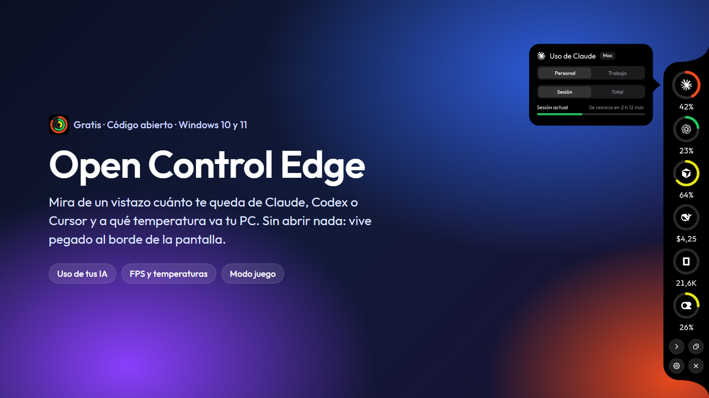
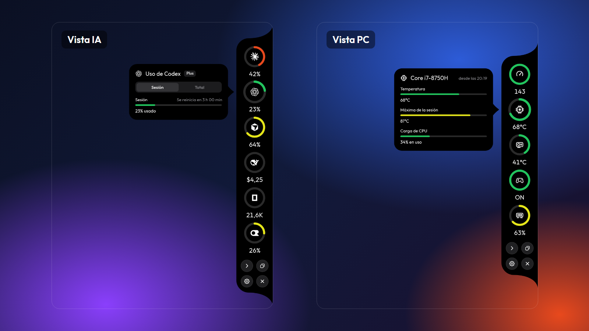
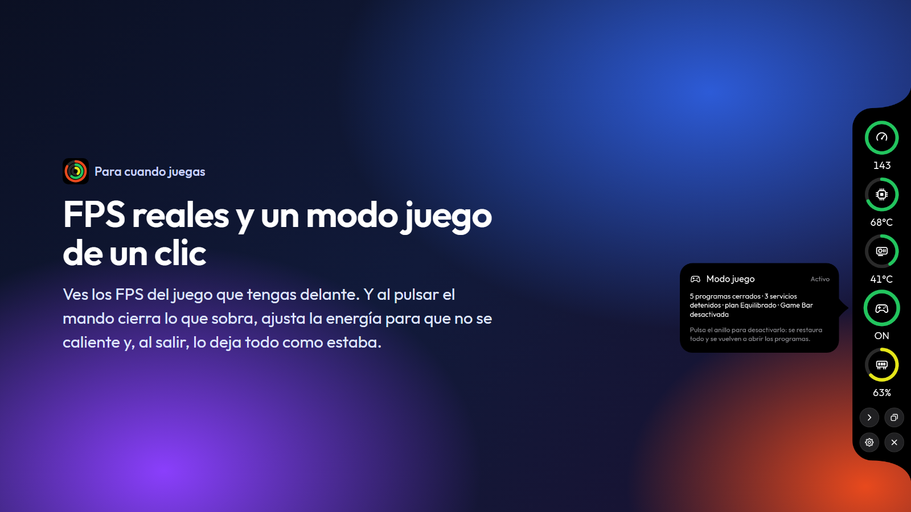
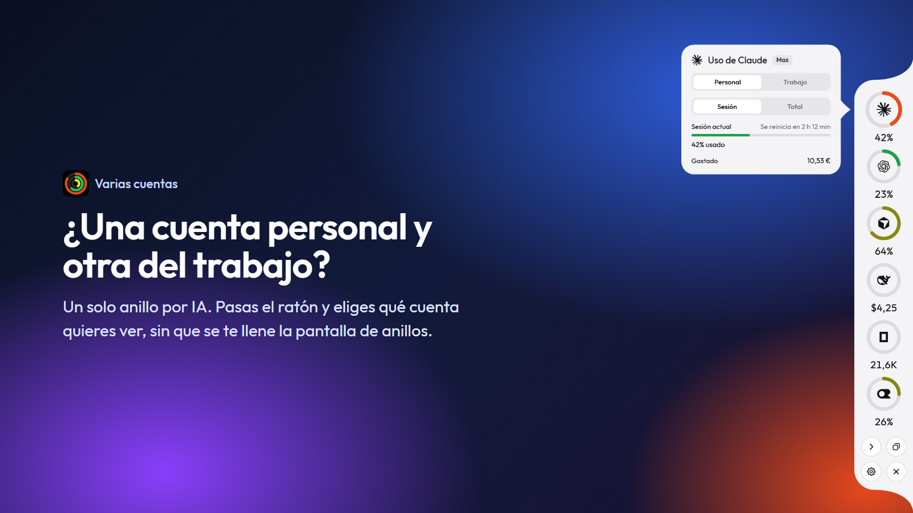
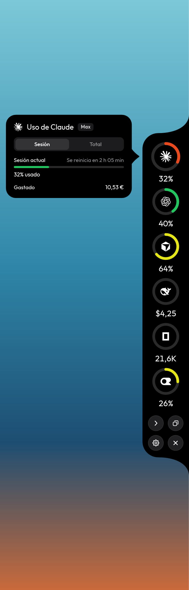
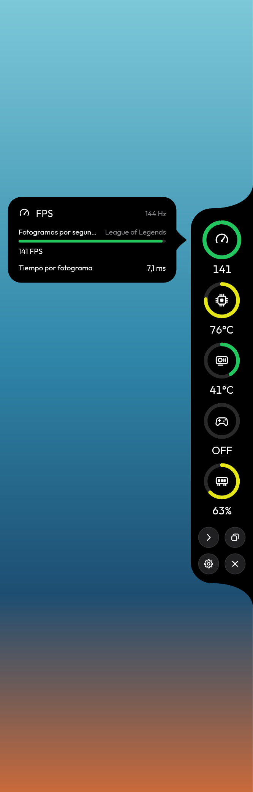
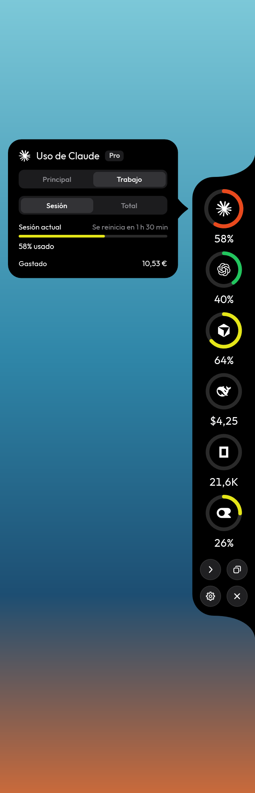
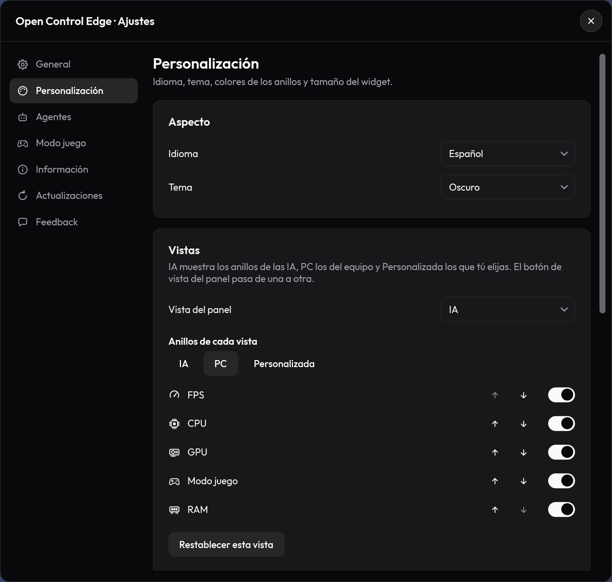
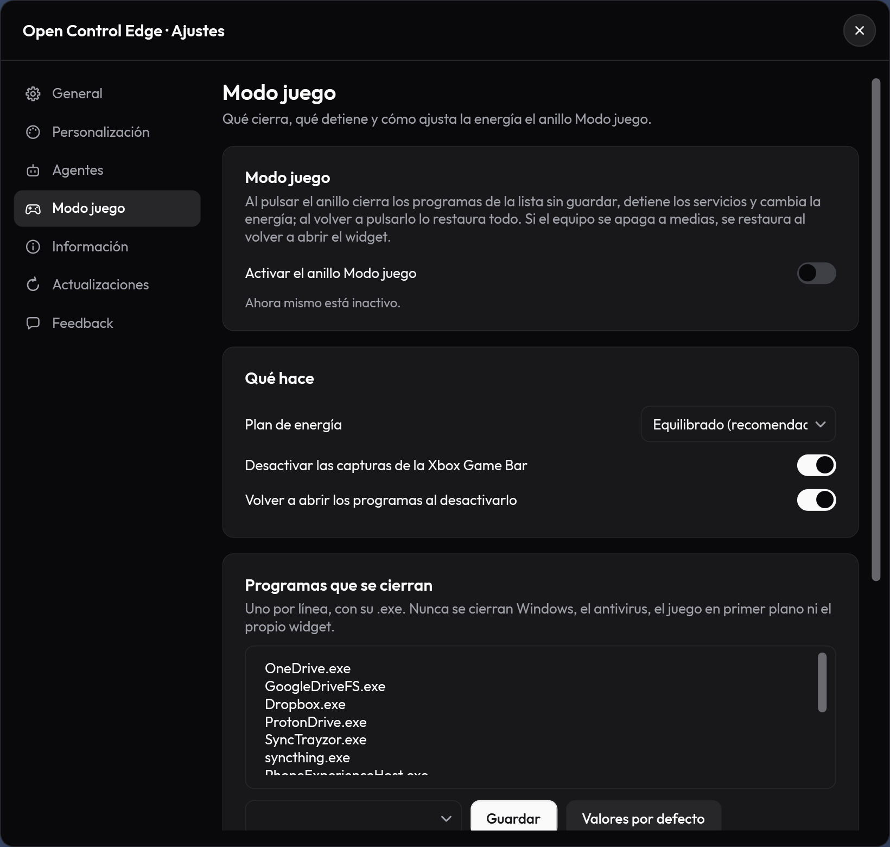
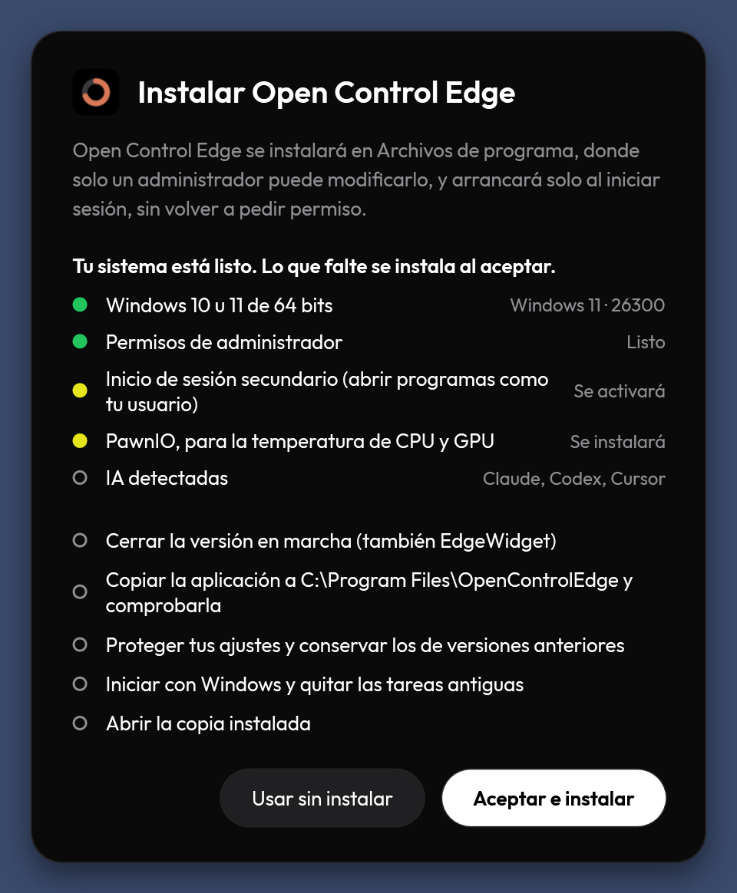

# Open Control Edge



Lo hice porque me pasaba el día mirando cuánto me quedaba de Claude y de Codex, y a qué temperatura iba el portátil
cuando jugaba. Ahora lo tengo todo en una columna de anillos pegada al borde de la pantalla: le pasas el ratón por
encima y te lo cuenta. Es gratis, es de código abierto y no te espía.

> *A Windows edge widget that shows your remaining Claude / Codex / Cursor quota, your CPU & GPU temperature and your
> game's FPS at a glance. The app speaks Spanish and English.*

   

## Descárgalo

### **[⬇ Descargar Open Control Edge](https://github.com/danielfinchdev/open-control-edge/releases/latest)**

Dentro está `OpenControlEdge-win-x64.zip`. Para instalarlo:

1. **Descomprime el ZIP** donde quieras (la carpeta Descargas vale).
2. **Abre `OpenControlEdge.exe`** y dile que sí a Windows cuando te pida permiso. Si te sale «Windows protegió tu PC»,
   pulsa «Más información» y luego «Ejecutar de todas formas»: sale porque el programa todavía no tiene un certificado de
   pago, no porque haga nada raro.
3. Verás **«Comprobando tu sistema…»**: revisa tu PC y prepara lo que falte (por ejemplo, el controlador para leer la
   temperatura). Pulsa **«Aceptar e instalar»** y ya está: aparece en el borde derecho y arranca solo con Windows.

A partir de ahí no tienes que volver por aquí: cuando saque una versión nueva verás **un punto rojo en el botón de
ajustes** y la instalas con un clic. (Si vienes de la 2.1.0, esta vez instálala a mano una sola vez.)

## Qué te enseña

- **Lo que te queda de cada IA**: Claude, Codex, Cursor, OpenCode, DeepSeek y OpenRouter. Cuánto llevas gastado de la
  sesión y de la semana, cuándo se reinicia y, si pagas aparte, lo que llevas gastado.
- **Cómo va tu PC**: temperatura de la CPU y de la gráfica, la RAM y los **FPS** del juego que tengas delante.
- **Modo juego**: un clic cierra lo que sobra en segundo plano, ajusta la energía para que no se caliente y, al
  quitarlo, lo deja todo como estaba.
- **Dos vistas y un botón**: una para tus IA, otra para el PC, y una a tu gusto. Así no se te llena la pantalla de anillos.
- **Varias cuentas**: si tienes una cuenta personal y otra del trabajo, eliges cuál ver al pasar el ratón.
- Lo pones a tu gusto: tema claro u oscuro, colores, **color de fondo**, tamaño, orden de los anillos.







## ¿Es de fiar?

- **Tu sesión solo va a su propio servicio.** Lee la sesión de Claude Code, Codex o Cursor únicamente para preguntarle
  a Anthropic, OpenAI o Cursor cuánto has usado; no la manda a nadie más y nunca la modifica.
- **Nada de telemetría.** No hay estadísticas, ni anuncios, ni cuentas. Solo habla con los servicios de tus IA, con
  GitHub para saber si hay versión nueva y, si tú pulsas «Enviar» en el feedback, con el servicio que me lo hace llegar.
- **El código está aquí**, a la vista de cualquiera. Las actualizaciones van firmadas y la app no instala nada que no
  lleve esa firma.

Todos los detalles, para quien los quiera, están más abajo, en [Privacidad y seguridad](#privacidad-y-seguridad).

## ¿Dudas, errores o ideas?

Desde la propia app: **Ajustes › Feedback**. Me escribes, añades una captura si quieres y pulsas «Enviar»; no hace
falta cuenta de nada. Si tienes cuenta de GitHub, también puedes abrir un
[issue](https://github.com/danielfinchdev/open-control-edge/issues).

---

# Para curiosos y desarrolladores

Todo lo de aquí abajo es el detalle técnico: requisitos, cómo funciona por dentro, de dónde salen los datos, seguridad y
cómo compilarlo.

## Requisitos

> [!IMPORTANT]
> **PawnIO es VITAL para leer la temperatura.** LibreHardwareMonitor, la librería que usa el
> widget para los sensores, necesita el controlador firmado **PawnIO** para acceder a los registros de bajo nivel
> de la CPU (MSR). Sin él, los anillos de CPU/GPU muestran «Instala PawnIO para ver la temperatura». La ventana de
> instalación lo comprueba y lo instala por ti; si prefieres hacerlo a mano, es la fila de abajo.

| Requisito | Para qué | Cómo |
|---|---|---|
| **PawnIO** (vital) | Leer la temperatura y la carga de la CPU | Lo instala la ventana de instalación, o `winget install --id namazso.PawnIO -e`, o el instalador oficial de [pawnio.eu](https://pawnio.eu) |
| Windows 11 (o Windows 10 22H2) | Sistema | — |
| Permisos de administrador | Leer los sensores y los FPS (el widget arranca elevado mediante una tarea programada) | Lo configura la ventana de bienvenida con un solo UAC |
| .NET 10 SDK | Solo para compilar | La versión Release ya incluye el runtime |

**Comprobar que PawnIO está instalado:** `winget list --id namazso.PawnIO` debe listarlo. Después, reinicia el widget:
el anillo de CPU debe mostrar grados en vez del aviso.

## Más capturas

| Panel real (datos reales) | Pestaña «Sesión» | Pestaña «Total» |
|---|---|---|
|  |  |  |

| Cursor | DeepSeek | Claves de API | Sin PawnIO |
|---|---|---|---|
|  |  |  |  |

| Vista IA | Vista PC | FPS | Modo juego | Dos cuentas de Claude |
|---|---|---|---|---|
|  |  |  |  |  |

| Ajustes › Personalización | Ajustes › Modo juego | Instalación |
|---|---|---|
|  |  |  |

La captura «Panel real» es del widget ejecutándose con cuentas reales (compilación Debug, sin administrador: por eso
la CPU sale sin dato). El resto las genera `--snapshot` con datos de ejemplo.

---

## Qué hace

Un panel negro anclado al borde derecho, siempre encima del resto de ventanas y sin botón en la barra
de tareas. Cada anillo es una fuente; al pasar el ratón por encima se despliega una tarjeta con el
detalle, que se desliza de un anillo a otro sin desaparecer.

| Anillo | Qué muestra |
|---|---|
| **Claude** | % de la sesión de 5 h, límite semanal y, si has gastado créditos de uso, el gasto en su moneda (p. ej. €) |
| **Codex** | % de la ventana de límite, etiquetada por su duración (sesión / diario / semanal / mensual) y, si la cuenta tiene créditos, el saldo de créditos |
| **Cursor** | % del ciclo mensual Pro y, si usas el pago bajo demanda, lo gastado en USD (y su límite) |
| **OpenCode** | Tokens de entrada / salida / razonamiento / caché y coste acumulado local |
| **DeepSeek** | Saldo API restante en la moneda devuelta por el proveedor |
| **OpenRouter** | % usado si la clave tiene límite; si no, gasto acumulado en USD |
| **FPS** | FPS del programa en primer plano (ver [Anillo de FPS](#anillo-de-fps)); la tarjeta enseña el proceso, los FPS, el tiempo de fotograma y los Hz del monitor |
| **CPU** | Temperatura actual, máxima de la sesión y carga |
| **GPU** | Temperatura, uso y memoria (NVIDIA o AMD; Intel si tiene sensor de temperatura) |
| **Modo juego** | Interruptor con un mando: vacío = apagado, lleno = encendido (ver [Modo juego](#modo-juego)) |
| **RAM** | % de memoria física usada; en la tarjeta, GB usados / totales, en caché y confirmada |

El gasto solo aparece cuando la respuesta del proveedor trae una cifra real mayor que cero; nunca se estima.

Los anillos de OpenCode aparecen si se detecta su CLI o sus datos locales; DeepSeek y OpenRouter aparecen al guardar una clave.
Claude, Codex y Cursor se detectan por sus clientes o credenciales. Puedes forzar u ocultar cada anillo en ajustes.
El anillo de GPU se oculta cuando no se detecta ninguna gráfica compatible. El panel se recentra con una animación
al mostrar u ocultar anillos.

### Vistas

El panel enseña una sola vista a la vez:

- **IA** — los anillos de las IA (Claude, Codex, Cursor, OpenCode, DeepSeek y OpenRouter).
- **PC** — FPS, CPU, GPU, Modo juego y RAM.
- **Personalizada** — la mezcla que quieras de anillos de las dos anteriores.

Un botón redondo del panel cambia de vista (IA → PC → Personalizada) con un fundido. En Ajustes → Personalización
eliges la vista activa y, por cada vista, qué anillos se ven y en qué orden (↑↓). Por defecto van por orden alfabético
y, en PC, el de FPS va primero. La escala del panel se calcula para la vista más grande (con los anillos disponibles),
así que no cambia de tamaño al pasar de una a otra. El fondo del panel también se elige ahí (**Fondo del widget**):
colores predefinidos, `#RRGGBB` o deslizadores R/G/B; negro por defecto, y sobre fondos claros el texto y los anillos
pasan solos a la variante oscura.

### Dos modos

- **Fijado** — el panel se queda siempre abierto.
- **Automático** — se recoge a una franja de 5 px en el borde y se despliega al acercar el ratón.

Se cambia con el botón del propio panel («Ocultar» / «Fijar») y la elección se recuerda. Los cuatro botones redondos
van de dos en dos: fijar/ocultar y vista arriba, ajustes y cerrar abajo.

### Pestañas «Sesión» / «Total»

Arriba del panel, dos pestañas eligen qué mide cada anillo de IA (la elección se recuerda):

- **Sesión** — la ventana corta: Claude 5 h, Codex su ventana más corta.
- **Total** — la ventana larga: Claude y Codex semanal (o la más larga), Cursor el ciclo mensual de facturación.

Cursor solo tiene el ciclo mensual, así que muestra lo mismo en las dos; Codex con una sola ventana (plan Go:
mensual), también. La tarjeta sigue enseñando todas las ventanas.

### Plan de cada cuenta

La cabecera de las tarjetas de Claude, Codex y Cursor lleva una etiqueta con el plan (Free, Go, Plus, Pro, Max,
Team…). Una cuenta gratuita de Claude no tiene límites de sesión ni semanales que medir: la tarjeta lo dice
(«Cuenta gratuita: sin límites de uso medibles») en vez de un error.

### Varias cuentas por IA

Claude, Codex y Cursor admiten más de una cuenta. En Ajustes → Agentes → Cuentas se añade otra por la carpeta de su
configuración y un nombre:

| IA | Carpeta de configuración | Debe contener |
|---|---|---|
| Claude | la de `CLAUDE_CONFIG_DIR` | `.credentials.json` |
| Codex | la de `CODEX_HOME` | `auth.json` |
| Cursor | la del `--user-data-dir` | `User\globalStorage\state.vscdb` |

Sigue habiendo un anillo por IA. La tarjeta lleva pestañas de cuenta (Principal · Trabajo) para elegir cuál enseña el
anillo, y la elección se recuerda. Renovar la sesión con un clic en el anillo de Claude solo vale para la cuenta
principal.

### Anillo de FPS

Es el primero de la vista PC. Enseña los FPS del programa que tienes en primer plano, contados como lo hace PresentMon:
a partir de los eventos de presentación de ETW (Microsoft-Windows-DXGI 42 y 55, D3D9 1 y DxgKrnl con el filtro de
eventos 166/168/171/184/252). Por proceso gana el tipo de evento más frecuente, y las apps Electron/Chromium se cuentan
por su proceso hijo de GPU. La sesión de ETW solo existe mientras el anillo está a la vista y se muestrea una vez por
segundo.

Necesita la copia elevada (la instalada). Sin elevar, o si el programa no presenta nada, enseña los FPS de composición
del escritorio (`DwmGetCompositionTimingInfo`). El arco es FPS / frecuencia del monitor.

### Modo juego

Anillo con un mando: vacío = apagado, lleno = encendido. **Está desactivado por defecto**; se activa en Ajustes → Modo
juego, que también deja editar qué hace al encenderse:

- **Programas que se cierran** (sin guardar): por defecto, sincronización en la nube, Phone Link, Teams y los
  auxiliares de la Xbox Game Bar.
- **Servicios que se detienen**: por defecto `WSearch`, `SysMain` y `DiagTrack`.
- **Plan de energía**: Equilibrado (por defecto), Alto rendimiento o No cambiarlo.
- **Desactivar las capturas de la Xbox Game Bar** (valores de `HKCU`).
- **Volver a abrir los programas al apagarlo**, como usuario normal.

Nunca cierra procesos protegidos ni del sistema, el proceso de la ventana en primer plano, el propio widget ni
`claude.exe`, y hay una lista de servicios que nunca detiene (`seclogon`, PawnIO…). El estado anterior se guarda en
`gamemode.json`, en la carpeta de datos, antes de cada cambio; se restaura al salir del widget y, si el equipo se apagó
con el modo encendido, al volver a abrirlo.

### Conexión con Orb

Open Control Edge y [Orb](https://github.com/danielfinchdev/orb-dev) se enseñan sus datos reales con dos archivos en
`%LOCALAPPDATA%\OrbPuente\`. Nada sale del equipo: no hay red, solo esa carpeta.

- **`oce.json`** lo escribe el widget cada 2 s (en `oce.json.tmp` y renombrándolo encima): carga y temperatura de CPU,
  GPU (nombre, carga, temperatura y VRAM), RAM en uso, FPS (solo mientras su anillo está a la vista) y, por IA, el
  porcentaje de la ventana corta, cuándo se reinicia y el plan de la cuenta principal. Lo que no se ha podido leer va
  como `null`. Nunca lleva tokens, correos ni rutas.
- **`orb.json`** lo escribe Orb cada 5 s y el widget solo lo lee (máximo 256 KB): sus tareas (en curso, en cola y por
  aprobar), si su asistente está trabajando y el uso de sus cuentas de IA.
- Orb cuenta como **conectado** solo si `orb.json` se entiende, es del esquema 1, tiene menos de 15 s y su `pid` es un
  proceso en marcha. Entonces aparece una marca «Orb» encima de los anillos (el punto se pone verde mientras su
  asistente trabaja; al pasar el ratón, sus tareas). Si no, no se enseña nada de Orb.
- Si un anillo de Claude, Codex o Cursor no tiene lectura propia, enseña la de Orb y la tarjeta lo indica («Dato de
  Orb · cuenta · ventana»). Esas lecturas no se guardan en la caché ni se reenvían en `oce.json`.
- Se apaga en Ajustes → Agentes → **Compartir datos con Orb** (`"shareWithOrb": false`): deja de escribir, borra
  `oce.json` y no lee `orb.json`. Al cerrar el widget también se borra `oce.json`.
- La copia instalada corre como administrador, pero toca esa carpeta con una copia de su token sin privilegios ni grupo
  Administradores y con nivel de integridad medio: un enlace puesto en la carpeta no puede llevar sus escrituras a
  ningún sitio donde tu cuenta normal no pudiera escribir.

### Detalles

- **Un clic en el anillo de Claude renueva la sesión sin abrir ninguna ventana** (ver
  [Mantener viva la sesión de Claude](#mantener-viva-la-sesión-de-claude)).
- **Un clic en el anillo de CPU** abre Configuración › Sistema › Información, sin privilegios de administrador.
- **Un clic en el anillo de RAM libera memoria** («Liberar RAM»): recorta la memoria de procesos accesibles de la sesión
  interactiva (`EmptyWorkingSet`), sin purgar la lista *standby*. Está desactivado por defecto; se activa con
  `"ramCleanup": true`.
- **Arranca con datos en 1–2 s**: la última lectura (solo porcentajes, fechas, planes e importes; ningún secreto) se
  guarda en `cache.json`, junto a los ajustes (ver [Configuración](#configuración)), y se pinta nada más abrir;
  después se refresca.
- **Avisos de actualización**: una versión nueva pone un punto rojo en el botón de ajustes (ver
  [Instalación](#instalación)).
- **Icono en la bandeja** con menú propio (Actualizar / Agentes y claves de API… / Iniciar con Windows / Desinstalar… / Salir)
  e información al pasar el ratón.
- **Aviso de temperatura**: cada pico por encima de 90 °C queda anotado en el registro, incluso cuando
  el panel está recogido. Útil si tu portátil se calienta y no sabes cuándo.
- **Instancia única**, se recoloca solo al cambiar de monitor o de escala, y sobrevive a un reinicio
  del Explorador de Windows.

---

## Instalación

Requisitos: **Windows 11** (o 10 22H2) y una cuenta administradora coincidente con el usuario de la sesión interactiva.

Firma: [Code signing policy](#code-signing-policy) (free code signing provided by SignPath.io, certificate by
SignPath Foundation) y, para las actualizaciones desde la app, la firma propia del proyecto (ver [Firma](#firma)).

1. Descarga el ZIP de la aplicación de la [última versión](../../releases/latest), o compílala (ver abajo).
   Los archivos de Releases los publica [GitHub Actions](../../actions) a partir de este código.
   El flujo publica una attestation verificable con
   `gh attestation verify OpenControlEdge.exe -R danielfinchdev/open-control-edge`.
   La comprobación de actualizaciones está **activada por defecto** (al arrancar y cada 6 h, se apaga en Ajustes →
   Actualizaciones). Si hay una versión nueva, el botón de ajustes lleva un punto rojo y Ajustes enseña «Nueva versión
   disponible · Descargar e instalar»: un clic descarga, verifica e instala, y el widget se reinicia. La aplicación solo
   acepta un ZIP que cumpla todo esto (si no, no instala nada):
   - su SHA-256 coincide con el `digest` que GitHub publica para ese archivo;
   - contiene exactamente `OpenControlEdge.exe` y sus 8 librerías nativas: ni un archivo más ni uno menos;
   - **si la Release trae `OpenControlEdge-win-x64.zip.sig`**: la firma ECDSA P-256 del ZIP coincide con la clave
     pública que lleva compilada la aplicación. Entonces no hacen falta las dos comprobaciones siguientes, pero el
     recurso de versión del ejecutable debe decir «Open Control Edge» y la versión anunciada;
   - **si no trae `.sig`**: el ejecutable tiene una firma Authenticode válida de SignPath Foundation (nombre exacto)
     y su recurso de versión dice «Open Control Edge» y la versión anunciada. SignPath Foundation firma muchos
     proyectos con esa misma identidad, así que esta comprobación se apoya también en que la descarga solo puede venir
     de las Releases de este repositorio; y cada librería es byte a byte la que trae la versión instalada o está
     firmada por su editor (Microsoft para las de WPF, Xamarin para las de Mono.Posix, SignPath Foundation para las
     que firme la Release).

   La attestation se puede verificar manualmente con GitHub CLI; la aplicación no ejecuta `gh` en segundo plano.

   > [!NOTE]
   > **Si vienes de la 2.1.0, instala la 2.2.0 a mano una vez** (pasos de abajo): la 2.1.0 solo acepta actualizaciones
   > firmadas por SignPath, y la 2.2.0 se firma con la clave propia del proyecto. Desde la 2.2.0 se actualiza sola.
2. Extrae el ZIP y abre `OpenControlEdge.exe`. Acepta el UAC (el único) y aparece la ventana
   **«Instalar Open Control Edge»**. Empieza con **«Comprobando tu sistema…»**: Windows 10/11 de 64 bits, permisos de
   administrador, el servicio Inicio de sesión secundario (se vuelve a activar si estaba desactivado), PawnIO (se
   instala solo, con `-install`) y qué IA se detectan. Si PawnIO falla, la instalación continúa y el anillo de CPU lo
   avisará. Al pulsar **Aceptar e instalar**:
   - cierra la versión en marcha (también EdgeWidget) y sus tareas;
   - copia a `C:\Program Files\OpenControlEdge` solo `OpenControlEdge.exe` y sus 8 librerías nativas. Comprueba
     con SHA-256 que la copia del ejecutable es idéntica al que aceptaste en el UAC y que cada librería es
     exactamente la que se publicó con él (sus SHA-256 van compilados dentro del ejecutable), antes de cambiar la
     carpeta de sitio (si algo falla, vuelve la copia anterior); después verifica que ningún usuario sin privilegios
     pueda escribir en la carpeta ni en el ejecutable. La instalación local no exige firma: instala el ejecutable que
     tú mismo has abierto;
   - protege `%ProgramData%\OpenControlEdge\<SID>` (sin enlaces ni puntos de reanálisis, escritura solo para
     administradores y etiqueta de integridad alta). Los ajustes de versiones anteriores no se migran;
   - registra el inicio con Windows (Programador de tareas: al iniciar sesión tu usuario, **sin retraso**, con
     privilegios elevados y prioridad normal) y quita las tareas antiguas `EdgeWidget` y «Claude - Mantener sesion».
     La carpeta `C:\Program Files\EdgeWidget` y tus ajustes se conservan;
   - arranca la copia instalada.

   «Usar sin instalar» y las opciones `--portable` / `--no-elevate` solo están disponibles si el proceso ya corre sin
   elevar; en una ejecución elevada la ventana oculta esa opción.

PawnIO también se puede instalar desde Ajustes → Información. Se descarga el asset oficial `PawnIO_setup.exe`;
antes de abrirlo se comprueba la firma Authenticode, el sujeto `CN=namazso.eu` y la huella
`F380DCC9F706E2756A5047B832FFE719E1BC35F5`. La carpeta temporal está bajo Archivos de programa y PowerShell no
interviene en la verificación.

Desde la copia instalada, el menú de la bandeja tiene **Iniciar con Windows** (activar / desactivar la tarea) y
**Desinstalar…**, que quita la tarea, cierra el widget y deja la carpeta de Archivos de programa marcada para
borrarse al reiniciar. Los datos de usuario en `%ProgramData%\OpenControlEdge\<SID>` se conservan.

### ¿Por qué necesita administrador?

Leer la temperatura de la CPU requiere acceso a los registros MSR del procesador, y eso solo se puede
hacer con privilegios elevados; contar los FPS de otros programas con ETW, también. Son las dos razones. Si prefieres no
dárselos, la compilación en modo Debug funciona sin elevar: verás todo menos la temperatura de la CPU y los FPS reales
del programa en primer plano (el anillo de FPS enseña entonces los de composición del escritorio).

Un límite que conviene conocer: la copia instalada arranca con la tarea programada y hereda el entorno de tu usuario.
Desde la 2.2 ignora `DOTNET_STARTUP_HOOKS` y no busca DLL en el `PATH`, pero .NET sigue leyendo del entorno las variables
de *profiler* (`CORECLR_ENABLE_PROFILING`, `CORECLR_PROFILER_PATH`) antes de que la aplicación arranque, y ningún ajuste
de la aplicación lo evita. Un programa que ya se ejecute con tu usuario podría usarlas para cargar código con permisos de
administrador al iniciar sesión; es la misma clase de riesgo que Microsoft no considera una frontera de seguridad del
control de cuentas (UAC), pero si te preocupa, no instales la copia elevada.

---

## Configuración

`%ProgramData%\OpenControlEdge\<SID>\OpenControlEdge.settings.json` (copia instalada) o
`%LOCALAPPDATA%\OpenControlEdge\OpenControlEdge.settings.json` (ejecución sin elevar).

El registro está junto a los ajustes; los blobs DPAPI de las claves están en la subcarpeta `keys\`.

```json
{
  "panelMode": "auto",
  "usageView": "session",
  "autoRenewClaude": true,
  "ramCleanup": false,
  "checkUpdates": true,
  "view": "ai",
  "providers": {
    "claude": "auto",
    "codex": "auto",
    "cursor": "auto",
    "opencode": "auto",
    "deepseek": "auto",
    "openrouter": "auto"
  }
}
```

| Clave | Valores | Qué hace |
|---|---|---|
| `panelMode` | `"pinned"` \| `"auto"` | Modo del panel. Lo escribe el propio botón. |
| `usageView` | `"session"` \| `"total"` | Pestaña de los anillos de IA. La escriben las propias pestañas. |
| `autoRenewClaude` | `true` (defecto) \| `false` | Renueva la sesión de Claude en segundo plano antes de que caduque. |
| `ramCleanup` | `false` (defecto) \| `true` | Permite «Liberar RAM» con un clic en el anillo de RAM. |
| `checkUpdates` | `true` (defecto) \| `false` | Busca versiones nuevas al arrancar y cada 6 h. Sustituye a `autoCheckUpdates` de la 2.1. |
| `shareWithOrb` | `true` (defecto) \| `false` | Intercambia lecturas con Orb en `%LOCALAPPDATA%\OrbPuente` (ver [Conexión con Orb](#conexión-con-orb)). |
| `view` | `"ai"` (defecto) \| `"pc"` \| `"custom"` | Vista del panel. La escribe el propio botón de vista. |
| `layouts` | objeto opcional | Por vista (`ai`, `pc`, `custom`): `order` (orden de los anillos) y `hidden` (los apagados). Lo escribe Ajustes → Personalización. |
| `panelBackground` | `"#RRGGBB"` (opcional) | Color de fondo del panel; si falta, el del tema (negro en el oscuro). |
| `gameMode` | objeto opcional | Modo juego: `enabled`, `processes`, `services`, `powerPlan` (`"balanced"` \| `"high"` \| `"keep"`), `disableGameBar` y `relaunch`. Lo escribe Ajustes → Modo juego. |
| `accounts` / `selectedAccounts` | objetos opcionales | Cuentas adicionales de `claude`, `codex` y `cursor` (`name` y `folder`) y la que enseña cada anillo (0 = principal). Lo escribe Ajustes → Agentes. |
| `providers` | objeto opcional | Visibilidad de cada anillo de IA (ver abajo). |

Cada clave dentro de `providers` (`claude`, `codex`, `cursor`, `opencode`, `deepseek`, `openrouter`) admite:

| Valor | Qué hace |
|---|---|
| `"auto"` | Muestra el anillo solo si el cliente está instalado (valor por defecto). |
| `"show"` | Fuerza el anillo aunque no se detecte la instalación (sin llamar a la API si no hay cliente). |
| `"hide"` | Oculta el anillo aunque el cliente esté instalado. |

Si omites `providers` o una clave concreta, se usa `"auto"`. El widget no escribe `providers` hasta que
los edites tú; al cambiar el modo del panel se conservan las claves que ya tuvieras.

---

## De dónde salen los datos

| Fuente | Origen | Credenciales |
|---|---|---|
| Claude | `api.anthropic.com/api/oauth/usage` | `%USERPROFILE%\.claude\.credentials.json` |
| Codex | `chatgpt.com/backend-api/wham/usage` | `%USERPROFILE%\.codex\auth.json` |
| Cursor | `cursor.com/api/usage-summary` | `%APPDATA%\Cursor\User\globalStorage\state.vscdb` (o el de la cuenta adicional) |
| OpenCode | Base local SQLite `opencode.db` | CLI o base de datos local |
| FPS | Eventos de presentación de ETW (PresentMon) y `DwmGetCompositionTimingInfo` | — |
| DeepSeek | `api.deepseek.com/user/balance` | Clave DPAPI CurrentUser |
| OpenRouter | `openrouter.ai/api/v1/key` | Clave DPAPI CurrentUser |
| CPU / GPU | [LibreHardwareMonitor](https://github.com/LibreHardwareMonitor/LibreHardwareMonitor) | — |

Las credenciales de Claude, Codex y Cursor son las de la cuenta principal; cada cuenta adicional usa las de su carpeta.
Los endpoints de Claude, Codex y Cursor **no están documentados** por sus proveedores. Los parsers exigen la forma
exacta de la respuesta: si cambia, el anillo muestra un error en vez de inventarse un número.

**Gasto y créditos** (formas comprobadas con peticiones reales el 29-09-2026, sin datos personales):

- Claude: `spend.used = { amount_minor, currency, exponent }` → importe en su moneda. Se muestra si es mayor que cero.
- Codex (`wham/usage`): `"credits": { "has_credits": false, "unlimited": false, "overage_limit_reached": false,
  "balance": null, "approx_local_messages": null, "approx_cloud_messages": null }` en una cuenta Go sin créditos.
  El saldo (en créditos, no en dinero) solo se muestra con `has_credits: true` y un `balance` numérico.
- Cursor (`usage-summary`): importes en **céntimos de dólar** (`individualUsage.plan = { used: 1429, limit: 2000 }`
  frente a los 20 $ incluidos en Pro). `individualUsage.onDemand = { enabled, used, limit, remaining }`: lo gastado
  bajo demanda se muestra si está activado y `used` es mayor que cero.

---

## Proveedores añadidos y claves de API

| IA | Fuente y métrica | Estado |
|---|---|---|
| OpenCode | Base local `opencode.db`: tokens de entrada/salida/razonamiento/caché y coste | Implementado; no usa red |
| DeepSeek | [`GET https://api.deepseek.com/user/balance`](https://api-docs.deepseek.com/api/get-user-balance/): saldo en CNY o USD | Implementado |
| Perplexity | No encontré una API pública oficial de uso o saldo | No implementado |
| GitHub Copilot | [API de facturación de GitHub](https://docs.github.com/en/rest/billing/usage): créditos consumidos; las peticiones premium solo aplican al modelo heredado | No implementado: no proporciona una cuota de peticiones universal para todas las cuentas |
| OpenRouter | [`GET https://openrouter.ai/api/v1/key`](https://openrouter.ai/docs/api/api-reference/api-keys/get-current-api-key): uso y límite de la clave | Implementado |
| Gemini CLI | `/stats`: estadísticas de sesión, no cuota persistente | No implementado |
| Mistral | [Admin API de uso](https://docs.mistral.ai/admin/admin-api/usage-metrics): consumo/coste de organización | Requiere clave admin y alcance de organización |
| Windsurf | Endpoint de cuota observado por terceros, no documentado oficialmente | No implementado |

### Cómo guardar o borrar claves

En el engranaje del widget, abre **Ajustes → Agentes**. DeepSeek y OpenRouter tienen un campo protegido para su clave con botones **Guardar** y **Borrar**.

Las claves se cifran con Windows DPAPI en ámbito `CurrentUser` y se guardan como blobs binarios en la subcarpeta `keys\` de la carpeta de datos. Nunca se guardan en el JSON de settings ni se escriben en el registro. Se descifran solo en memoria para formar la cabecera HTTPS.

### Datos locales de OpenCode

El detector busca `opencode` en `PATH` o `opencode.db` en el directorio de datos. Se respetan `OPENCODE_DB` y `XDG_DATA_HOME`; también se inspeccionan las ubicaciones de datos habituales de Windows. El lector abre solo la base activa `opencode.db` con SQLite en solo lectura y agrega solamente columnas de uso de la tabla `session`; en la copia instalada lo hace un proceso sin privilegios (ver [Privacidad y seguridad](#privacidad-y-seguridad)). No consulta la CLI para obtener los datos y no crea conexiones de red.

La prueba del parser incluida en `--snapshot` usa este objeto **normalizado interno**; no representa una salida prometida de `opencode stats --json`:

```json
{
  "totalTokens": {
    "input": 12345,
    "output": 6789,
    "reasoning": 321,
    "cache": { "read": 2100, "write": 55 }
  },
  "totalCost": 1.2345
}
```

La tarjeta muestra los cinco contadores y el coste registrado. Si falta la tabla o cualquier campo esperado, indica error en lugar de calcular una cifra aproximada.

### Destinos de red y seguridad

Además de Claude, Codex y Cursor, el widget contacta estos destinos solo para actualizar las tarjetas:

- `https://api.deepseek.com/user/balance` (DeepSeek; requiere la clave cifrada del usuario).
- `https://openrouter.ai/api/v1/key` (OpenRouter; requiere la clave cifrada del usuario).

Y estos dos por otros motivos:

- Las Releases de este repositorio en GitHub, para buscar y descargar actualizaciones (activado por defecto; se apaga en
  Ajustes → Actualizaciones).
- `https://formsubmit.co` (FormSubmit), solo cuando pulsas **Enviar** en Ajustes → Feedback. Se manda el tipo de
  mensaje, el texto, el correo de contacto si lo has escrito, la versión de la aplicación, la versión de Windows y las
  imágenes que hayas añadido (hasta 3). FormSubmit lo reenvía por correo al autor; su dirección queda detrás de un alias
  de FormSubmit. Sin pulsar **Enviar** no sale nada.

OpenCode es local. Perplexity y Windsurf no se contactan. Las cabeceras y los cuerpos de respuesta nunca se registran; los servicios muestran errores propios y tienen timeout de 15 segundos.

---

## Privacidad y seguridad

Este programa lee archivos de credenciales. Merece que se explique exactamente qué hace con ellos.

**Qué lee, y solo eso**

- De `.credentials.json`: únicamente `claudeAiOauth.accessToken`, `expiresAt` y `subscriptionType` (el plan).
- De `auth.json`: únicamente `tokens.access_token` y, del `id_token`, solo el claim
  `https://api.openai.com/auth` → `chatgpt_plan_type` (el plan). El `id_token` se decodifica desde los bytes del
  archivo sin convertirlo en cadena; el resto de sus claims (correo, identificadores…) se saltan.
- De `state.vscdb`: únicamente `cursorAuth/accessToken` y `cursorAuth/stripeMembershipType`; el token se materializa
  como cadena porque se envía en la cookie HTTPS; el claim `sub` se lee directamente con `Utf8JsonReader`. La base se
  abre en solo lectura y en modo defensivo, y en la copia instalada no la abre el proceso elevado (ver «El proceso
  elevado no abre bases SQLite» más abajo). La base de OpenCode, igual.
- Cursor envía la sesión en la cookie de la petición HTTPS a `cursor.com`; nunca la guarda ni la registra.

Todo lo demás —**incluidos los tokens de refresco, el resto del `id_token` y el `account_id`**— se salta a nivel
de lector JSON, sin llegar nunca a convertirse en una cadena de texto en memoria (el token de Cursor es la excepción indicada arriba). Los archivos se abren
en **solo lectura** y no se escriben jamás. El búfer se limpia con `Array.Clear` al terminar de leer.

**Qué no hace**

- No renueva tokens por sí mismo ni escribe los archivos de credenciales. Si el token de acceso está caducado, ni
  siquiera envía la petición. La renovación de Claude la hace la propia CLI de Claude Code, lanzada como usuario
  normal (ver abajo); el widget solo lee la fecha de caducidad antes y después.
- Nada de lo que lanza hereda sus permisos de administrador: la CLI de Claude y Configuración se abren con el token
  del Explorador de tu sesión (`CreateProcessWithTokenW`), tras comprobar que es tu misma cuenta y que no está
  elevado. Si no se puede, no se lanza nada.
- No escribe secretos en el registro. Solo códigos de estado HTTP y mensajes propios; nunca cuerpos de
  respuesta ni cabeceras. La única salida ajena que se anota es la primera línea de error de la CLI de Claude cuando
  falla, recortada a 160 caracteres y con cualquier secuencia de 24 o más caracteres de aspecto de clave o token
  sustituida por «…».
- Solo envía peticiones HTTPS a los endpoints de Claude, Codex, Cursor, DeepSeek y OpenRouter indicados en este README,
  a las Releases de este repositorio (actualizaciones) y, solo si pulsas **Enviar** en Feedback, a FormSubmit con lo que
  se detalla en «Destinos de red y seguridad». OpenCode no usa red, y el puente con Orb tampoco: son dos archivos en
  `%LOCALAPPDATA%\OrbPuente` (ver [Conexión con Orb](#conexión-con-orb)).
  Al renovar la sesión, la CLI de Claude Code hace además su propia petición mínima a Anthropic (un «ok» a Haiku).
- No tiene telemetría, ni analítica ni servicios residentes. La comprobación de actualizaciones (al arrancar y cada
  6 h) está activada por defecto y se apaga en Ajustes → Actualizaciones; la descarga e instalación siempre se piden con
  un clic.

**El proceso elevado no abre bases SQLite**

Las bases de Cursor (`state.vscdb`) y OpenCode (`opencode.db`) las escribe un programa que corre con tu usuario, así que
se tratan como no confiables. La copia instalada no las interpreta con permisos de administrador: arranca su propio
ejecutable como usuario normal (`--read-database cursor|opencode <ruta|auto>`, con `__COMPAT_LAYER=RunAsInvoker`, oculto,
dentro de un *job* que lo cierra y con un límite de 20 s). Ese proceso abre el archivo en solo lectura y en modo
defensivo (`trusted_schema` desactivado, comprobación de celdas, sin mapear en memoria, solo archivos normales) y
escribe un JSON pequeño por una tubería. Cuesta un arranque corto por cada refresco de Cursor u OpenCode (~0,1 s de CPU
y ~30 MB durante menos de un segundo) y nada entre refrescos. Las copias sin elevar (Debug) lo leen en el propio
proceso.

**El ejecutable vive en `C:\Program Files`, a propósito**

La tarea programada lo arranca como administrador sin pedir UAC. Si el ejecutable estuviese en una
carpeta donde tu usuario puede escribir, cualquier programa que se ejecutase con tu cuenta —sin ser
administrador— podría sustituirlo y heredar esos permisos en el siguiente inicio de sesión. En
`C:\Program Files` solo un administrador puede escribir. El instalador verifica los permisos y avisa si
no son correctos. Ajustes, registro, claves y caché del proceso elevado solo se escriben en una carpeta protegida
de `%ProgramData%\OpenControlEdge\<SID>`.

**Lo que queda, dicho claramente**

- El widget corre como administrador y maneja tokens OAuth. Es una superficie de ataque mayor que la de
  un programa normal. Está mitigado con lo anterior, no eliminado.
- LibreHardwareMonitor carga un controlador de kernel (PawnIO) mientras el widget está abierto. Es el
  mecanismo estándar para leer sensores en Windows, pero es código de kernel de terceros.
- Mientras no esté activa la firma (ver [Firma](#firma)), el ejecutable no está firmado: SmartScreen puede avisar la
  primera vez.
- «Liberar RAM», como administrador, recorta la memoria de los procesos de tu sesión (no vacía la caché del sistema).
  No borra datos de nadie, pero durante unos segundos los programas vuelven a cargar de disco lo que necesiten; la
  memoria «liberada» vuelve a ocuparse en cuanto se usa. Por eso está desactivado por defecto.
- El ejecutable que lee esas bases es el mismo que el widget, pero corre sin privilegios: un fallo al interpretar un
  archivo manipulado queda dentro de ese proceso, que no hereda los permisos de administrador. Si no usas Cursor ni
  OpenCode, ocúltalos en Ajustes → Agentes y el widget no las abrirá.
- Modo juego, como administrador, cierra programas y detiene servicios de la lista que tú editas, y cambia el plan de
  energía y valores de `HKCU`. Los programas se cierran sin guardar. Lo anterior se anota en `gamemode.json` antes de
  cada cambio para restaurarlo, y está desactivado por defecto.
- Las actualizaciones desde la app confían en que solo el autor publique las Releases de este repositorio y en la
  clave de firma del proyecto (`UPDATE_SIGNING_KEY`, un secreto de GitHub Actions): quien la obtuviera podría firmar
  un ZIP que la app instalaría. La firma de SignPath Foundation, que se sigue exigiendo cuando no hay `.sig`,
  identifica al firmante, no al proyecto (ver [Instalación](#instalación)).

---

## Mantener viva la sesión de Claude

El token de acceso de Claude Code dura unas 8 horas. Cuando caduca, el anillo se queda en `--`.

Lo que **no** lo renueva: abrir la aplicación de escritorio de Claude (guarda su sesión en otro sitio),
ni `claude auth status` (solo informa). Lo único que lo renueva es una llamada real a la API, que hace
que la CLI use el token de refresco y reescriba el archivo.

El widget lo hace él solo, sin scripts ni tareas programadas y **sin abrir ninguna ventana**:

- **Clic en el anillo de Claude**: la tarjeta pasa a «Renovando sesión…», se ejecuta una vez la CLI de Claude Code,
  se vuelve a leer el uso y la tarjeta dice el resultado («Sesión renovada: vale hasta las 18:53», «Sesión vigente
  hasta…» o un error claro, como «No se encuentra Claude Code» o «Claude Code no ha respondido en 60 s»).
- **En segundo plano** (`"autoRenewClaude": true`, por defecto): cuando al token le quedan menos de 30 minutos, se
  lanza 4 minutos antes de que caduque, como mucho una vez cada 30 minutos.
- La CLI se busca en `%USERPROFILE%\.local\bin\claude.exe` (instalador nativo), luego en el binario nativo del
  paquete npm (`%APPDATA%\npm\node_modules\@anthropic-ai\claude-code\bin\claude.exe`) y, si no, `node` + `cli.js`
  de paquetes npm antiguos.
- La llamada es la mínima posible:
  `claude -p --no-session-persistence --model haiku --tools "" --strict-mcp-config ok` (sin herramientas, sin
  servidores MCP, sin guardar la conversación), sin ventana (`CREATE_NO_WINDOW`), dentro de un *job* que la cierra
  entera si pasa de **60 s**, y **como tu usuario normal**, nunca como administrador.
- Comprobado en Claude Code 2.1.284: la CLI solo refresca el token cuando le quedan **menos de 5 minutos**. Antes de
  eso la llamada termina bien pero deja el token como estaba; por eso la tarjeta dice entonces «Sesión vigente
  hasta…» y la renovación automática se programa dentro de esos 5 minutos.
- En el registro quedan la duración, el código de salida, el resultado y, si la CLI falla, su primera línea de error
  saneada (ver [Privacidad y seguridad](#privacidad-y-seguridad)). **Nunca ningún token.**

---

## Compilar

Requisitos: [.NET 10 SDK](https://dotnet.microsoft.com/download/dotnet/10.0) (`global.json` fija la 10.0.401).

```powershell
git clone https://github.com/danielfinchdev/open-control-edge.git
cd open-control-edge
dotnet publish src\OpenControlEdge\OpenControlEdge.csproj -c Release -r win-x64 -o dist
.\dist\OpenControlEdge.exe
```

**Release** genera una carpeta autocontenida (no hace falta tener .NET instalado) que el flujo entrega como ZIP;
al abrir su ejecutable aparece la ventana de instalación, que la copia completa (exige administrador). El ejecutable
va sin comprimir y con ReadyToRun: medido el 29-09-2026, pinta el primer fotograma con datos en ~0,8 s en caliente y
~1,5 s la primera vez, con ~150 MB de memoria, frente a ~1,4 s / 2,2 s y ~260 MB con compresión (ver CHANGELOG).
**Debug** arranca sin elevar ni ofrecer la instalación, para iterar la interfaz sin UAC (`--welcome` la muestra).

El flujo de Build solo se ejecuta en `main`. Cada etiqueta `v*` lanza el mismo `dotnet publish` en
[Actions](../../actions), firma el ZIP para las actualizaciones (ver [Firma](#firma)) y adjunta el ZIP y su `.sig` a la
[Release](../../releases):

```powershell
git tag v1.2.0
git push origin v1.2.0
```

### Revisar la interfaz sin ejecutar el widget

```powershell
.\src\OpenControlEdge\bin\Debug\net10.0-windows\win-x64\OpenControlEdge.exe --snapshot C:\temp\capturas
```

Renderiza **219 PNG** con los dos modos, las tres vistas, las pestañas, las tarjetas (RAM, FPS y Modo juego
incluidos), los estados de la renovación de Claude, el gasto de Claude / Codex / Cursor, varias cuentas, estados de
error y sin datos, una cuenta gratuita de Claude, anillos ocultos, el requisito de PawnIO, temas, idiomas, escalas,
la marca de Orb conectado, menú de bandeja, diálogo de claves y la ventana de instalación (bienvenida, comprobación del sistema, progreso, hecho,
error y desinstalar), y la ventana de Ajustes en varios tamaños de pantalla. Incluye pruebas de los créditos de Codex y del gasto bajo demanda de Cursor con las formas reales
observadas, del puente con Orb (cuándo cuenta como conectado y la forma exacta de `oce.json`), y una base de OpenCode de prueba leída con el servicio real (se borra al terminar). No lee credenciales, no
toca los ajustes ni abre los sensores ni escribe en el registro.

---

## Firma

El flujo de Release está preparado para firmar `OpenControlEdge.exe` con **[SignPath Foundation](https://signpath.org/)**,
gratis para proyectos de código abierto: sube la carpeta publicada como artefacto, envía la petición de firma, espera
a que termine, comprueba la firma Authenticode y adjunta a la Release el ZIP con el ejecutable firmado. Mientras no
existan los datos de SignPath, el paso se salta con un aviso y el ejecutable de la Release sale sin firma Authenticode
(el ZIP sí lleva la firma propia de [Firma propia para las actualizaciones](#firma-propia-para-las-actualizaciones)).

Pasos para activarla (los da el dueño del repositorio):

1. Solicitar el alta del proyecto en [signpath.org/foundation](https://signpath.org/foundation) (formulario de
   proyectos de código abierto). Piden que el repositorio sea público, con licencia OSI (MIT vale), releases
   construidas en GitHub Actions y la política de firma publicada (sección siguiente).
2. Cuando lo aprueben, en SignPath: instalar la aplicación de GitHub de SignPath en el repositorio, crear el proyecto
   (por ejemplo `open-control-edge`) con un *trusted build system* de GitHub y una **configuración de artefacto** que
   firme el ejecutable dentro del ZIP del artefacto, solo si su recurso de versión dice el nombre del proyecto y la
   versión de la etiqueta (el flujo la pasa como parámetro `version` y comprueba que coincide con el csproj):
   ```xml
   <artifact-configuration xmlns="http://signpath.io/artifact-configuration/v1">
     <parameters>
       <parameter name="version" />
     </parameters>
     <zip-file>
       <pe-file path="OpenControlEdge.exe" product-name="Open Control Edge" product-version="${version}">
         <authenticode-sign />
       </pe-file>
     </zip-file>
   </artifact-configuration>
   ```
   y una política de firma (por ejemplo `release-signing`) con aprobación manual.
3. En GitHub → *Settings* → *Secrets and variables* → *Actions*:
   - secreto `SIGNPATH_API_TOKEN` (token de API de un usuario de SignPath con permiso de envío);
   - variables `SIGNPATH_ORGANIZATION_ID`, `SIGNPATH_PROJECT_SLUG` y `SIGNPATH_SIGNING_POLICY_SLUG`.
4. Publicar una etiqueta `v*`: el flujo pedirá la firma y esperará a que se apruebe en SignPath.

Solo se firma el ejecutable: SignPath Foundation no firma componentes de terceros. Las librerías de WPF y de
Mono.Posix ya vienen firmadas por su editor; `e_sqlite3.dll` (SQLite) no. Con la firma de SignPath como única garantía,
una actualización que cambie `e_sqlite3.dll` (al actualizar SQLitePCLRaw) la rechaza la app y hay que instalarla una vez
desde su ZIP; la firma propia de abajo evita ese caso.

### Firma propia para las actualizaciones

Mientras SignPath no esté aprobado (la solicitud sigue pendiente), y como vía propia después, el flujo de Release firma el ZIP completo con una clave
ECDSA P-256 del proyecto y publica el resultado como `OpenControlEdge-win-x64.zip.sig` (Base64 de la firma IEEE P1363
sobre SHA-256). La clave privada es el secreto de GitHub Actions `UPDATE_SIGNING_KEY` (PEM PKCS#8); la pública va
compilada en la aplicación. Si falta el secreto, el flujo avisa y la Release sale sin `.sig`.

Al actualizarse, la app instala un ZIP cuya firma coincide con esa clave pública: la firma cubre todos los archivos, así
que ya no hacen falta la firma Authenticode ni las comprobaciones por DLL. Se siguen exigiendo el SHA-256 que publica
GitHub, la lista cerrada de archivos y que el recurso de versión del ejecutable diga «Open Control Edge» y la versión
anunciada. Si la `.sig` no coincide, o la Release no la lleva, la actualización se rechaza.

## Code signing policy

Free code signing provided by [SignPath.io](https://about.signpath.io/), certificate by
[SignPath Foundation](https://signpath.org/).

- Committers and reviewers: [danielfinchdev](https://github.com/danielfinchdev)
- Approvers: [danielfinchdev](https://github.com/danielfinchdev)

Every release is built from this repository by GitHub Actions (`.github/workflows/release.yml`); only builds of tagged
commits are submitted for signing, and each signing request is approved manually by an approver.

**Privacy:** this program will not transfer any information to other networked systems unless specifically requested
by the user or the person installing or operating it. It only sends HTTPS requests to the usage endpoints of the AI
services the user is signed in to or has added an API key for (listed in «De dónde salen los datos»), carrying the
user's own credentials; it has no telemetry. It also checks this repository's GitHub Releases for updates at start-up
and every 6 hours (on by default, can be turned off in Settings; installing an update always takes a click), PawnIO is
downloaded from its official release only when the user asks for it or accepts the installation window's system check,
and feedback is sent to FormSubmit (formsubmit.co) only when the user presses "Enviar" in Settings → Feedback.

---

## Contribuir

Las propuestas llegan como *pull request* contra `main` y las revisa el mantenedor antes de fusionarlas (ver
[Code signing policy](#code-signing-policy)). Los mensajes de commit van en español, cortos y en imperativo.
Antes de enviar un cambio, comprueba que `dotnet build -c Release` termina sin avisos ni errores.

---

## Cómo está hecho

**C# 14 / .NET 10 / WPF.** Sin frameworks de interfaz, sin MVVM, sin inyección de dependencias: una
ventana, unos cuantos controles dibujados a mano y llamadas directas a la API de Windows.

```
src/OpenControlEdge/
├─ Services/     Lectura de credenciales, APIs de uso, sensores, ajustes, registro, lector de bases de datos, Modo juego y FPS
├─ Ui/           Anillo, barra, iconos, paleta, formatos
├─ Views/        Ventana del borde, menú de bandeja, renderizador de capturas
└─ Interop/      user32 / shell32: bandeja, posición, clic-a-través; tokens, procesos, memoria y seguridad
```

Algunas decisiones que quizá no son obvias:

- **Una sola ventana** contiene la franja, el panel y la tarjeta. Así la tarjeta puede deslizarse de un
  anillo a otro con animaciones de render en vez de mover ventanas del sistema.
- **El hover se detecta sondeando la posición del cursor**, no con eventos: cuando el panel está
  recogido la ventana es transparente a los clics (`WS_EX_TRANSPARENT`) y no recibe ratón en absoluto.
- **Ese sondeo va en dos velocidades.** Cada vuelta empieza con una comprobación barata; el sondeo rápido
  solo se activa sobre las zonas interactivas del panel, franja o tarjeta, y en reposo se duerme del todo (lo despierta
  el propio ratón). El consumo medido está en el [CHANGELOG](CHANGELOG.md) (2.1.0).
- **Los sensores dependen de si el panel está a la vista**: cada 20 s con el panel fijado y visible, cada 60 s si no.
  Nunca se paran del todo, para que «Máxima de la sesión» sea una cifra real y no solo los momentos en que estabas
  mirando. El uso de las IAs se consulta con el intervalo elegido en Ajustes (2 minutos por defecto).
- **Los anillos y las barras son `FrameworkElement` con `OnRender`**, no plantillas de control. Menos
  árbol visual y control exacto del trazo.
- **Los iconos están dibujados en código** en un espacio de 24×24, no son fuentes ni SVG.
- **El icono de bandeja usa `Shell_NotifyIcon` directamente**, sin WinForms, con los filtros UIPI que
  hacen falta para que un proceso elevado reciba los clics de un Explorer de integridad media.

---

## Licencia

[MIT](LICENSE). Úsalo, cámbialo y publícalo como quieras.

---

## Créditos

Sensores: [LibreHardwareMonitor](https://github.com/LibreHardwareMonitor/LibreHardwareMonitor) (MPL-2.0).

Tipografía: [Outfit](https://github.com/Outfitio/Outfit-Fonts) (pesos 400, 500 y 600), incrustada en el ejecutable
(SIL Open Font License 1.1, ver [`OFL.txt`](src/OpenControlEdge/Assets/Fonts/OFL.txt)).

Los iconos son glifos genéricos dibujados para este proyecto, no logotipos de marca. OpenControlEdge no está
asociado con Anthropic, OpenAI, Anysphere, DeepSeek, OpenRouter ni OpenCode.

# Feedback

Errores e ideas, desde Ajustes → Feedback, de dos maneras:

- **Enviar**: no necesita ninguna cuenta. El mensaje llega por correo al autor a través de [FormSubmit](https://formsubmit.co)
  (su dirección queda detrás de un alias de FormSubmit), con hasta 3 capturas (PNG o JPEG de hasta 5 MB: **Capturar
  pantalla** fotografía la pantalla principal y **Añadir imagen…** elige un archivo) y un correo de contacto opcional
  si quieres respuesta. Se envían el tipo, el texto, ese correo (si lo escribes), la versión de la aplicación, la versión
  de Windows y las imágenes, y solo al pulsar **Enviar**.
- **Abrir en GitHub**: abre un issue público ya rellenado, con tu cuenta de GitHub, y copia al portapapeles la primera
  captura para que la pegues. Revisa y edita el texto antes de enviarlo.

No incluyas datos personales ni de otras personas en el texto ni en las capturas.
