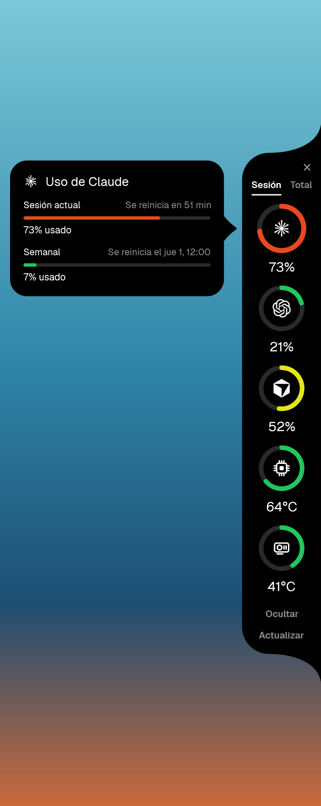
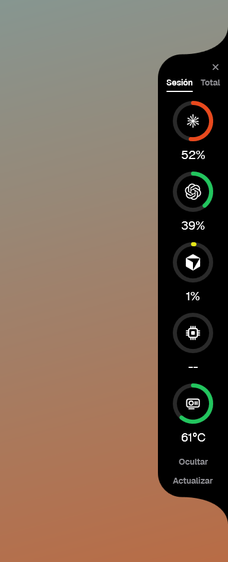
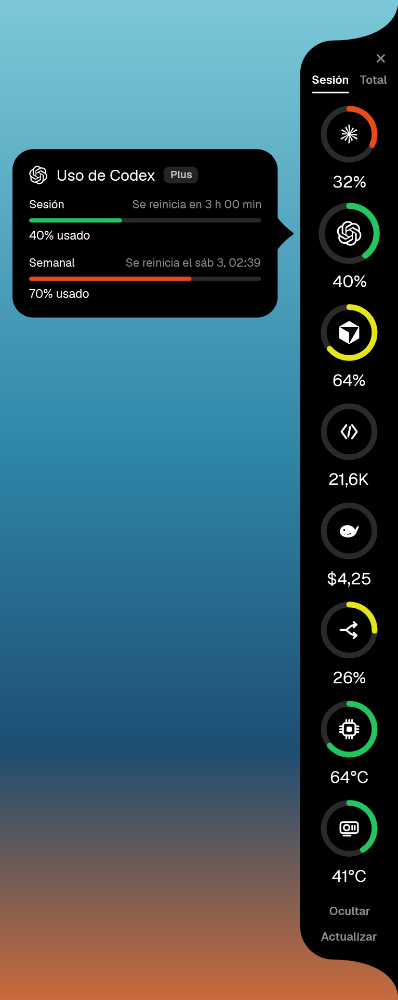
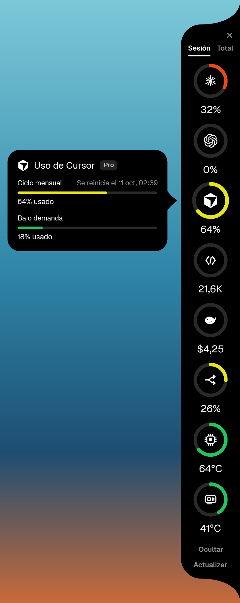
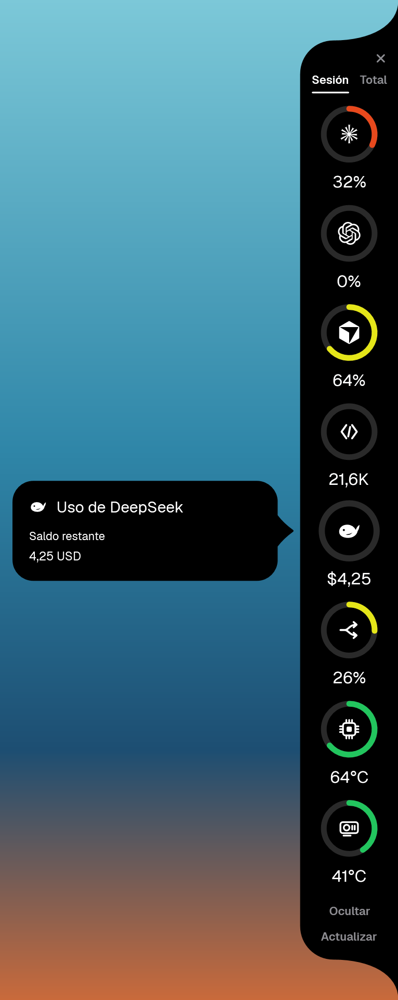
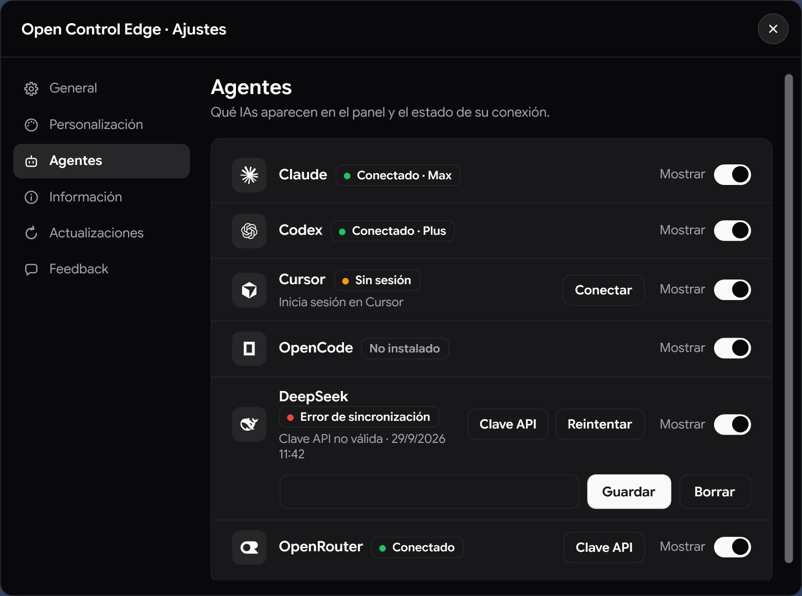
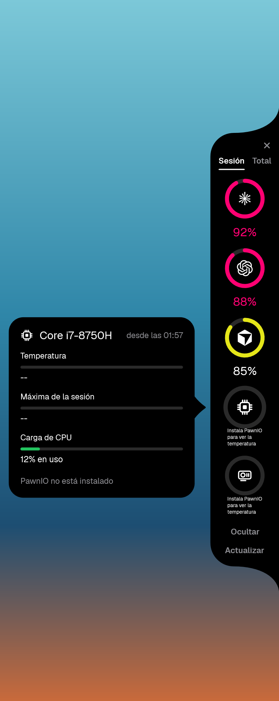

# Open Control Edge (antes EdgeWidget)

**Un widget de escritorio para Windows 11 que muestra, pegado al borde de la pantalla, cuánto te queda
de cada IA y a qué temperatura está tu portátil.**

> *A Windows 11 edge widget showing your remaining Claude / Codex / Cursor quota and your CPU & GPU
> temperature at a glance. Interface and documentation are in Spanish.*

   

<p align="center">
  
  &nbsp;&nbsp;
  
</p>

Con instalador PowerShell, sin servicios en segundo plano ni telemetría. Solo consulta los endpoints documentados
abajo para actualizar tarjetas y lee los datos de OpenCode localmente.

---

## Requisitos

> [!IMPORTANT]
> **Instala PawnIO antes que nada: es VITAL para leer la temperatura.** LibreHardwareMonitor, la librería que usa el
> widget para los sensores, necesita el controlador firmado **PawnIO** para acceder a los registros de bajo nivel
> de la CPU (MSR). Sin él, los anillos de CPU/GPU muestran «Instala PawnIO para ver la temperatura».

| Requisito | Para qué | Cómo |
|---|---|---|
| **PawnIO** (vital) | Leer la temperatura y la carga de la CPU | `winget install --id namazso.PawnIO -e` o el instalador oficial de [pawnio.eu](https://pawnio.eu) |
| Windows 11 (o Windows 10 22H2) | Sistema | — |
| Permisos de administrador | Leer los sensores (el widget arranca elevado mediante una tarea programada) | Lo configura `instalar.ps1` con un solo UAC |
| .NET 8 SDK | Solo para compilar | La versión Release ya incluye el runtime |

**Comprobar que PawnIO está instalado:** `winget list --id namazso.PawnIO` debe listarlo. Después, reinicia el widget:
el anillo de CPU debe mostrar grados en vez del aviso. `tools\instalar.ps1` también lo comprueba y ofrece instalarlo.

## Capturas

| Panel real (datos reales) | Pestaña «Sesión» | Pestaña «Total» |
|---|---|---|
|  |  |  |

| Cursor | DeepSeek | Claves de API | Sin PawnIO |
|---|---|---|---|
|  |  |  |  |

La captura «Panel real» es del widget ejecutándose con cuentas reales (compilación Debug, sin administrador: por eso
la CPU sale sin dato). El resto las genera `--snapshot` con datos de ejemplo.

---

## Qué hace

Un panel negro anclado al borde derecho, siempre encima del resto de ventanas y sin botón en la barra
de tareas. Cada anillo es una fuente; al pasar el ratón por encima se despliega una tarjeta con el
detalle, que se desliza de un anillo a otro sin desaparecer.

| Anillo | Qué muestra |
|---|---|
| **Claude** | % de la sesión de 5 h, límite semanal y gasto acumulado en € |
| **Codex** | % de la ventana de límite, etiquetada por su duración (sesión / diario / semanal / mensual) |
| **Cursor** | % del ciclo mensual Pro y, si existe, bajo demanda |
| **OpenCode** | Tokens de entrada / salida / razonamiento / caché y coste acumulado local |
| **DeepSeek** | Saldo API restante en la moneda devuelta por el proveedor |
| **OpenRouter** | % usado si la clave tiene límite; si no, gasto acumulado en USD |
| **CPU** | Temperatura actual, máxima de la sesión y carga |
| **GPU** | Temperatura, uso y memoria (NVIDIA) |

Los anillos de OpenCode aparecen si se detecta su CLI o sus datos locales; DeepSeek y OpenRouter aparecen al guardar una clave.
Claude, Codex y Cursor se detectan por sus clientes o credenciales. Puedes forzar u ocultar cada anillo en ajustes.
El anillo de GPU sigue ocultándose cuando no hay NVIDIA detectada. El panel se recentra con una animación
al mostrar u ocultar anillos.

### Dos modos

- **Fijado** — el panel se queda siempre abierto.
- **Automático** — se recoge a una franja de 5 px en el borde y se despliega al acercar el ratón.

Se cambia con el botón del propio panel («Ocultar» / «Fijar») y la elección se recuerda.

### Pestañas «Sesión» / «Total»

Arriba del panel, dos pestañas eligen qué mide cada anillo de IA (la elección se recuerda):

- **Sesión** — la ventana corta: Claude 5 h, Codex su ventana más corta.
- **Total** — la ventana larga: Claude y Codex semanal (o la más larga), Cursor el ciclo mensual de facturación.

Cursor solo tiene el ciclo mensual, así que muestra lo mismo en las dos; Codex con una sola ventana (plan Go:
mensual), también. La tarjeta sigue enseñando todas las ventanas.

### Plan de cada cuenta

La cabecera de las tarjetas de Claude, Codex y Cursor lleva una etiqueta con el plan (Free, Go, Plus, Pro, Max,
Team…). Una cuenta gratuita de Claude no tiene límites de sesión ni semanales que medir: la tarjeta lo dice
(«Cuenta gratuita: sin límites de uso medibles») en vez de un error.

### Detalles

- **Un clic en el anillo de Claude solicita renovar la sesión** mediante la tarea de usuario y abre Claude Code,
  para que el anillo no se quede en `--` cuando el token caduca.
- **Icono en la bandeja** con menú propio (Actualizar / Claves de API… / Salir) e información al pasar el ratón.
- **Aviso de temperatura**: cada pico por encima de 90 °C queda anotado en el registro, incluso cuando
  el panel está recogido. Útil si tu portátil se calienta y no sabes cuándo.
- **Instancia única**, se recoloca solo al cambiar de monitor o de escala, y sobrevive a un reinicio
  del Explorador de Windows.

---

## Instalación

Requisitos: **Windows 11** (o 10 22H2) y una cuenta administradora coincidente con el usuario de la sesión interactiva.

1. Descarga el ZIP de la aplicación de la [última versión](../../releases/latest), o compílala (ver abajo).
   Los archivos de Releases los publica [GitHub Actions](../../actions) a partir de este código.
   Cuando el flujo de Release publique attestations, se pueden verificar con
   `gh attestation verify OpenControlEdge.exe -R danielfinchdev/open-control-edge`.
2. Extrae el ZIP y ejecuta el instalador incluido desde PowerShell:

```powershell
powershell -ExecutionPolicy Bypass -File .\instalar.ps1
```

Copia los archivos publicados a `C:\Program Files\OpenControlEdge`, crea una tarea programada que lo arranca al
iniciar sesión como administrador, y lo lanza. Conserva los ajustes del usuario.

Para quitar el arranque automático:

```powershell
powershell -ExecutionPolicy Bypass -File .\instalar.ps1 -Desinstalar
```

### ¿Por qué necesita administrador?

Leer la temperatura de la CPU requiere acceso a los registros MSR del procesador, y eso solo se puede
hacer con privilegios elevados. Es la única razón. Si prefieres no dárselos, la compilación en modo
Debug funciona sin elevar: verás todo menos la temperatura de la CPU.

---

## Configuración

`%LOCALAPPDATA%\OpenControlEdge\OpenControlEdge.settings.json`

El registro está en `%LOCALAPPDATA%\OpenControlEdge\widget.log`; los blobs DPAPI de las claves están en la subcarpeta `keys\`.

```json
{
  "panelMode": "auto",
  "usageView": "session",
  "providers": {
    "claude": "auto",
    "codex": "auto",
    "cursor": "auto",
    "opencode": "auto",
    "deepseek": "auto",
    "openrouter": "auto"
  }
}
```

| Clave | Valores | Qué hace |
|---|---|---|
| `panelMode` | `"pinned"` \| `"auto"` | Modo del panel. Lo escribe el propio botón. |
| `usageView` | `"session"` \| `"total"` | Pestaña de los anillos de IA. La escriben las propias pestañas. |
| `providers` | objeto opcional | Visibilidad de cada anillo de IA (ver abajo). |

Cada clave dentro de `providers` (`claude`, `codex`, `cursor`, `opencode`, `deepseek`, `openrouter`) admite:

| Valor | Qué hace |
|---|---|
| `"auto"` | Muestra el anillo solo si el cliente está instalado (valor por defecto). |
| `"show"` | Fuerza el anillo aunque no se detecte la instalación (sin llamar a la API si no hay cliente). |
| `"hide"` | Oculta el anillo aunque el cliente esté instalado. |

Si omites `providers` o una clave concreta, se usa `"auto"`. El widget no escribe `providers` hasta que
los edites tú; al cambiar el modo del panel se conservan las claves que ya tuvieras.

---

## De dónde salen los datos

| Fuente | Origen | Credenciales |
|---|---|---|
| Claude | `api.anthropic.com/api/oauth/usage` | `%USERPROFILE%\.claude\.credentials.json` |
| Codex | `chatgpt.com/backend-api/wham/usage` | `%USERPROFILE%\.codex\auth.json` |
| Cursor | `cursor.com/api/usage-summary` | `%APPDATA%\Cursor\User\globalStorage\state.vscdb` |
| OpenCode | Base local SQLite `opencode.db` | CLI o base de datos local |
| DeepSeek | `api.deepseek.com/user/balance` | Clave DPAPI CurrentUser |
| OpenRouter | `openrouter.ai/api/v1/key` | Clave DPAPI CurrentUser |
| CPU / GPU | [LibreHardwareMonitor](https://github.com/LibreHardwareMonitor/LibreHardwareMonitor) | — |

Los endpoints de Claude, Codex y Cursor **no están documentados** por sus proveedores. Los parsers exigen la forma
exacta de la respuesta: si cambia, el anillo muestra un error en vez de inventarse un número.

---

## Proveedores añadidos y claves de API

| IA | Fuente y métrica | Estado |
|---|---|---|
| OpenCode | Base local `opencode.db`: tokens de entrada/salida/razonamiento/caché y coste | Implementado; no usa red |
| DeepSeek | [`GET https://api.deepseek.com/user/balance`](https://api-docs.deepseek.com/api/get-user-balance/): saldo en CNY o USD | Implementado |
| Perplexity | No encontré una API pública oficial de uso o saldo | No implementado |
| GitHub Copilot | [API de facturación de GitHub](https://docs.github.com/en/rest/billing/usage): créditos consumidos; las peticiones premium solo aplican al modelo heredado | No implementado: no proporciona una cuota de peticiones universal para todas las cuentas |
| OpenRouter | [`GET https://openrouter.ai/api/v1/key`](https://openrouter.ai/docs/api/api-reference/api-keys/get-current-api-key): uso y límite de la clave | Implementado |
| Gemini CLI | `/stats`: estadísticas de sesión, no cuota persistente | No implementado |
| Mistral | [Admin API de uso](https://docs.mistral.ai/admin/admin-api/usage-metrics): consumo/coste de organización | Requiere clave admin y alcance de organización |
| Windsurf | Endpoint de cuota observado por terceros, no documentado oficialmente | No implementado |

### Cómo guardar o borrar claves

En el menú de la bandeja, selecciona **Claves de API…**. El diálogo tiene un `PasswordBox` para DeepSeek y otro para OpenRouter, con botones **Guardar** y **Borrar**. También se abre desde consola con:

```powershell
OpenControlEdge.exe --set-key deepseek
OpenControlEdge.exe --set-key openrouter
```

Las claves se cifran con Windows DPAPI en ámbito `CurrentUser` y se guardan como blobs binarios en `%LOCALAPPDATA%\OpenControlEdge\keys\deepseek.bin` y `openrouter.bin`. Nunca se guardan en el JSON de settings ni se escriben en el registro. Se descifran solo en memoria para formar la cabecera HTTPS.

### Datos locales de OpenCode

El detector busca `opencode` en `PATH` o `opencode.db` en el directorio de datos. Se respetan `OPENCODE_DB` y `XDG_DATA_HOME`; también se inspeccionan las ubicaciones de datos habituales de Windows. El lector abre solo la base activa `opencode.db` con SQLite en solo lectura y agrega solamente columnas de uso de la tabla `session`. No consulta la CLI para obtener los datos y no crea conexiones de red.

La prueba del parser incluida en `--snapshot` usa este objeto **normalizado interno**; no representa una salida prometida de `opencode stats --json`:

```json
{
  "totalTokens": {
    "input": 12345,
    "output": 6789,
    "reasoning": 321,
    "cache": { "read": 2100, "write": 55 }
  },
  "totalCost": 1.2345
}
```

La tarjeta muestra los cinco contadores y el coste registrado. Si falta la tabla o cualquier campo esperado, indica error en lugar de calcular una cifra aproximada.

### Destinos de red y seguridad

Además de Claude, Codex y Cursor, el widget contacta estos destinos solo para actualizar las tarjetas:

- `https://api.deepseek.com/user/balance` (DeepSeek; requiere la clave cifrada del usuario).
- `https://openrouter.ai/api/v1/key` (OpenRouter; requiere la clave cifrada del usuario).

OpenCode es local. Perplexity y Windsurf no se contactan. Las cabeceras y los cuerpos de respuesta nunca se registran; los servicios muestran errores propios y tienen timeout de 15 segundos.

---

## Privacidad y seguridad

Este programa lee archivos de credenciales. Merece que se explique exactamente qué hace con ellos.

**Qué lee, y solo eso**

- De `.credentials.json`: únicamente `claudeAiOauth.accessToken`, `expiresAt` y `subscriptionType` (el plan).
- De `auth.json`: únicamente `tokens.access_token` y, del `id_token`, solo el claim
  `https://api.openai.com/auth` → `chatgpt_plan_type` (el plan). El `id_token` se decodifica desde los bytes del
  archivo sin convertirlo en cadena; el resto de sus claims (correo, identificadores…) se saltan.
- De `state.vscdb`: únicamente `cursorAuth/accessToken` y `cursorAuth/stripeMembershipType`; el token se materializa
  como cadena porque se envía en la cookie HTTPS; el claim `sub` se lee directamente con `Utf8JsonReader`. La base se abre en solo lectura.
- Cursor envía la sesión en la cookie de la petición HTTPS a `cursor.com`; nunca la guarda ni la registra.

Todo lo demás —**incluidos los tokens de refresco, el resto del `id_token` y el `account_id`**— se salta a nivel
de lector JSON, sin llegar nunca a convertirse en una cadena de texto en memoria (el token de Cursor es la excepción indicada arriba). Los archivos se abren
en **solo lectura** y no se escriben jamás. El búfer se limpia con `Array.Clear` al terminar de leer.

**Qué no hace**

- No renueva tokens. Si el token de acceso está caducado, ni siquiera envía la petición: muestra que abras Claude Code o Codex para renovarlo. La renovación de Claude la hace un script aparte, como usuario normal.
- No escribe secretos en el registro. Solo códigos de estado HTTP y mensajes propios; nunca cuerpos de
  respuesta ni cabeceras.
- Solo envía peticiones HTTPS a los endpoints de Claude, Codex, Cursor, DeepSeek y OpenRouter indicados en este README. OpenCode no usa red.
- No tiene telemetría, ni analítica, ni actualizaciones automáticas, ni servicios residentes.

**El ejecutable vive en `C:\Program Files`, a propósito**

La tarea programada lo arranca como administrador sin pedir UAC. Si el ejecutable estuviese en una
carpeta donde tu usuario puede escribir, cualquier programa que se ejecutase con tu cuenta —sin ser
administrador— podría sustituirlo y heredar esos permisos en el siguiente inicio de sesión. En
`C:\Program Files` solo un administrador puede escribir. El instalador verifica los permisos y avisa si
no son correctos.

**Lo que queda, dicho claramente**

- El widget corre como administrador y maneja tokens OAuth. Es una superficie de ataque mayor que la de
  un programa normal. Está mitigado con lo anterior, no eliminado.
- LibreHardwareMonitor carga un controlador de kernel (PawnIO) mientras el widget está abierto. Es el
  mecanismo estándar para leer sensores en Windows, pero es código de kernel de terceros.
- El ejecutable no está firmado: SmartScreen puede avisar la primera vez.

---

## Mantener viva la sesión de Claude

El token de acceso de Claude Code dura unas 8 horas. Cuando caduca, el anillo se queda en `--`.

Lo que **no** lo renueva: abrir la aplicación de escritorio de Claude (guarda su sesión en otro sitio),
ni `claude auth status` (solo informa). Lo único que lo renueva es una llamada real a la API, que hace
que la CLI use el token de refresco y reescriba el archivo.

`tools\claude-sesion.ps1` automatiza eso:

```powershell
# Instalar (no necesita administrador)
powershell -ExecutionPolicy Bypass -File tools\claude-sesion.ps1 -Instalar -AbrirApp

# Renovar ahora mismo
powershell -ExecutionPolicy Bypass -File tools\claude-sesion.ps1 -Forzar
```

- Se dispara al iniciar sesión **con 3 minutos de retraso** y después **cada 4 horas**.
- Solo llama a la API si al token le quedan menos de 2 horas. Si le queda margen, no hace nada.
- La llamada es la mínima posible: `claude -p --tools "" --no-session-persistence --model haiku ok`.
- Deja constancia en `tools\claude-sesion.log`. **Nunca escribe ningún token**, solo fechas.

El clic en el anillo de Claude lanza esta misma tarea. Si no está instalada, la tarjeta lo dice y solo se
abre Claude Code (que no renueva el token).

---

## Compilar

Requisitos: [.NET 8 SDK](https://dotnet.microsoft.com/download/dotnet/8.0).

```powershell
git clone https://github.com/danielfinchdev/open-control-edge.git
cd open-control-edge
dotnet publish src\OpenControlEdge\OpenControlEdge.csproj -c Release -r win-x64 -o dist
powershell -ExecutionPolicy Bypass -File tools\instalar.ps1
```

**Release** genera una carpeta autocontenida (no hace falta tener .NET instalado) que el flujo entrega como ZIP;
el instalador la copia completa y exige administrador. **Debug** arranca sin elevar, para iterar la interfaz sin UAC.

Cada etiqueta `v*` lanza el mismo `dotnet publish` en [Actions](../../actions) y adjunta el ZIP de la aplicación a la [Release](../../releases):

```powershell
git tag v1.2.0
git push origin v1.2.0
```

### Revisar la interfaz sin ejecutar el widget

```powershell
.\src\OpenControlEdge\bin\Debug\net8.0-windows\win-x64\OpenControlEdge.exe --snapshot C:\temp\capturas
```

Renderiza **36 PNG** con los dos modos, las pestañas, las ocho tarjetas, estados de error y sin datos, una cuenta gratuita de Claude, anillos ocultos, el requisito de PawnIO, menú de bandeja y diálogo de claves. Incluye una prueba del parser de OpenCode con JSON de ejemplo. No lee credenciales, no toca los ajustes ni abre los sensores ni escribe en el registro.

---

## Contribuir

Después de clonar, instala el hook que quita las firmas de IA (`Co-authored-by: Claude/Cursor/Codex`,
«Generated with…») de los mensajes de commit:

```powershell
powershell -ExecutionPolicy Bypass -File tools\instalar-hooks.ps1
```

Los mensajes de commit van en español, cortos y en imperativo. Escríbelos a mano o genéralos desde el botón
del IDE (Cursor / VS Code → **Control de código fuente** → **Generar mensaje de commit**, el icono de destellos
junto al cuadro del mensaje) y revísalos antes de confirmar. `.claude/settings.json` desactiva además la
atribución automática de Claude Code en commits y PR. Las reglas para las IAs que trabajan en el repositorio
están en [AGENTS.md](AGENTS.md).

---

## Cómo está hecho

**C# 12 / .NET 8 / WPF.** Sin frameworks de interfaz, sin MVVM, sin inyección de dependencias: una
ventana, unos cuantos controles dibujados a mano y llamadas directas a la API de Windows.

```
src/OpenControlEdge/
├─ Services/     Lectura de credenciales, APIs de uso, sensores, ajustes, registro
├─ Ui/           Anillo, barra, iconos, paleta, formatos
├─ Views/        Ventana del borde, menú de bandeja, renderizador de capturas
└─ Interop/      user32 / shell32: bandeja, posición, clic-a-través
```

Algunas decisiones que quizá no son obvias:

- **Una sola ventana** contiene la franja, el panel y la tarjeta. Así la tarjeta puede deslizarse de un
  anillo a otro con animaciones de render en vez de mover ventanas del sistema.
- **El hover se detecta sondeando la posición del cursor**, no con eventos: cuando el panel está
  recogido la ventana es transparente a los clics (`WS_EX_TRANSPARENT`) y no recibe ratón en absoluto.
- **Ese sondeo va en dos velocidades.** Cada vuelta empieza con una comprobación barata; el sondeo rápido
  solo se activa sobre las zonas interactivas del panel, franja o tarjeta. No hay una medición de CPU de v2 publicada todavía.
- **Las cadencias dependen de si el panel está a la vista**: sensores cada 20 s / 60 s, uso cada 2 / 6
  minutos. Los sensores nunca se paran del todo, para que «Máxima de la sesión» sea una cifra real y no
  solo los momentos en que estabas mirando.
- **Los anillos y las barras son `FrameworkElement` con `OnRender`**, no plantillas de control. Menos
  árbol visual y control exacto del trazo.
- **Los iconos están dibujados en código** en un espacio de 24×24, no son fuentes ni SVG.
- **El icono de bandeja usa `Shell_NotifyIcon` directamente**, sin WinForms, con los filtros UIPI que
  hacen falta para que un proceso elevado reciba los clics de un Explorer de integridad media.

---

## Licencia

[MIT](LICENSE). Úsalo, cámbialo y publícalo como quieras.

---

## Créditos

Sensores: [LibreHardwareMonitor](https://github.com/LibreHardwareMonitor/LibreHardwareMonitor) (MPL-2.0).

Tipografía: [Google Sans Flex](https://github.com/google/fonts/tree/main/ofl/googlesansflex) de Google, incrustada en el ejecutable
(SIL Open Font License 1.1, ver [`OFL.txt`](src/OpenControlEdge/Assets/Fonts/OFL.txt)).

Los iconos son glifos genéricos dibujados para este proyecto, no logotipos de marca. OpenControlEdge no está
asociado con Anthropic, OpenAI, Anysphere, DeepSeek, OpenRouter ni OpenCode.
